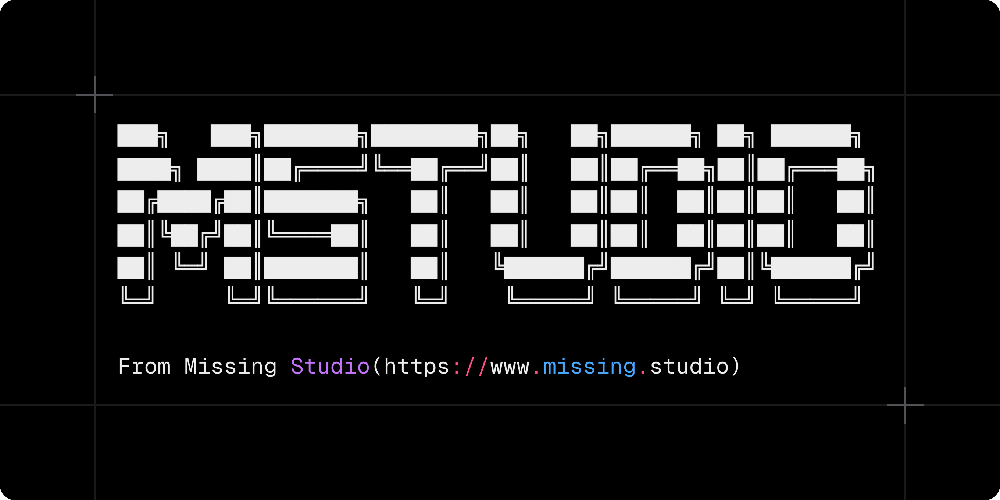

Missing Studio's AI assistant for interacting with Model Context Protocol (MCP) servers. It provides a friendly, interactive terminal UI to get started quickly.

- Node.js: >= 18
- Binaries: `missingstudio` (primary), `mstudio` (alias)

## Install

- npm: `npm i -g @missingstudio/cli`
- pnpm: `pnpm add -g @missingstudio/cli`
- yarn: `yarn global add @missingstudio/cli`

## Usage

Run without arguments to launch the interactive UI:

```bash
mstudio
```

Common options:

- `-V, --version`: Output the version number
- `-h, --help`: Show help information
- `-v, --verbose`: Enable verbose logging

You can also invoke via the alias:

```bash
missingstudio OR
npx @missingstudio/cli
```

## Development

- Install deps: `npm install`
- Start in dev (watch): `npm run dev`
- Build: `npm run build`
- Start from build: `npm start`
- Typecheck: `npm run typecheck`
- Tests: `npm test` (watch: `npm run test:watch`)
- Lint/format: `npm run format` (fix: `npm run format:fix`)

## Links

- Website: https://www.missing.studio
- Repository: https://github.com/missingstudio/cli
- Issues: https://github.com/missingstudio/cli/issues

## Changelog

See `CHANGELOG.md` for release history.

## License

MIT © Missing Studio. See `LICENSE` for details.
